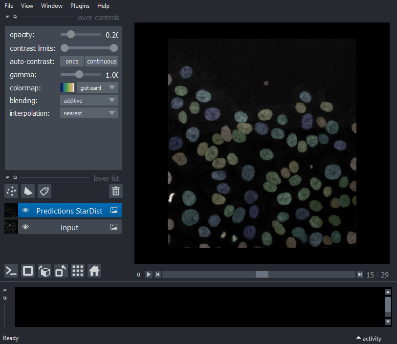
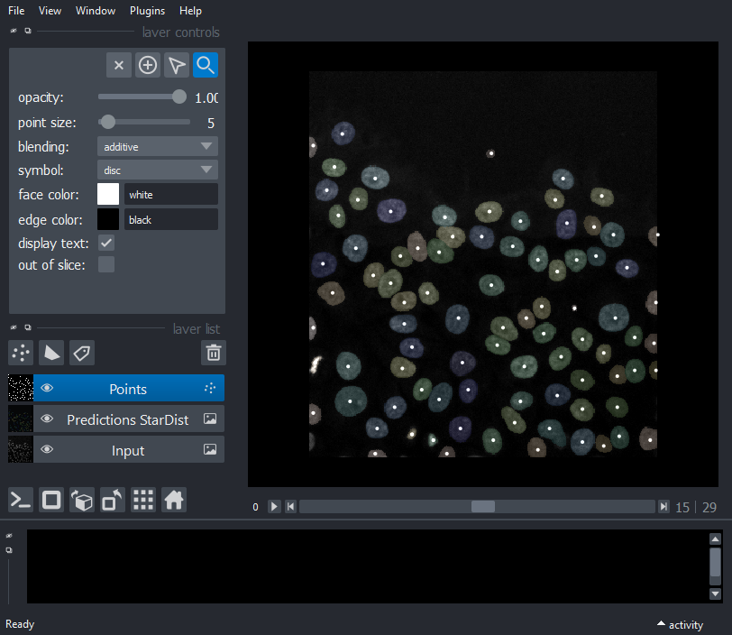

Example 2: StarDist (Detection) + Stracking (Tracker)
=====================================================

This example shows a combination of StarDist Detection and Stracking
(Tracker)

Load trained mode
-----------------

.. code-block:: python3

    from stardist.models import StarDist2D 
    
    # prints a list of available models 
    StarDist2D.from_pretrained() 
    
    # creates a pretrained model
    model = StarDist2D.from_pretrained('2D_versatile_fluo')

.. parsed-literal::

    There are 4 registered models for 'StarDist2D':
    
    Name                  Alias(es)
    ────                  ─────────
    '2D_versatile_fluo'   'Versatile (fluorescent nuclei)'
    '2D_versatile_he'     'Versatile (H&E nuclei)'
    '2D_paper_dsb2018'    'DSB 2018 (from StarDist 2D paper)'
    '2D_demo'             None
    Found model '2D_versatile_fluo' for 'StarDist2D'.
    Loading network weights from 'weights_best.h5'.
    Loading thresholds from 'thresholds.json'.
    Using default values: prob_thresh=0.479071, nms_thresh=0.3.
    

StarDist: Prediction and detection
----------------------------------

.. code-block:: python3

    from csbdeep.utils import normalize
    import matplotlib.pyplot as plt
    from tifffile import imread
    import numpy as np
    from stracking.detectors import SSegDetector
    
    folder=""
    filename="P31-crop2.tif"
    
    img= imread(folder+filename)
    
    labels=np.zeros(img.shape);
    
    img=normalize(img)
    
    
    for i in range(img.shape[0]):
        labels[i,:,:],details = model.predict_instances(img[i,:,:])

    sdetector = SSegDetector(is_mask=False)
    particles = sdetector.run(labels)

Create an empty napari viewer
-----------------------------

.. code-block:: python3

    %gui qt

    import napari
    from napari.utils import nbscreenshot
    viewer = napari.Viewer(axis_labels='tyx')

Display Input and StarDist Prediction
-------------------------------------

.. code-block:: python3

    viewer.add_image(img, name='Input', multiscale=False,
                     contrast_limits=[0, 3], colormap='gray',blending='additive');
    
    viewer.add_image(labels, name='Predictions StarDist', multiscale=False,
                     colormap='gist_earth',blending='additive',opacity=0.2);
    
    nbscreenshot(viewer)

Display spots from StarDist
---------------------------

.. code-block:: python3

    viewer.add_points(particles.data, size=5, blending='additive')
    nbscreenshot(viewer)

Linker
------

Shortest path tracking with euclidean cost

.. code-block:: python3

    from stracking.linkers import SPLinker, EuclideanCost
    
    euclidean_cost = EuclideanCost(max_cost=100);
    my_tracker = SPLinker(cost=euclidean_cost, gap=1);
    tracks = my_tracker.run(particles);
    

.. parsed-literal::

    detections shape= (2652, 3)
    num frames= 30
    cost= 60244.0
    self.cost.max_cost= 100
    cost= 256.0
    self.cost.max_cost= 100
    cost= 16.0
    self.cost.max_cost= 100
    cost= 11236.0
    self.cost.max_cost= 100
    extract track...
    dim in track to path= 2
    add predecessor...
    add predecessor...
    add predecessor...
    
    

Display tracks
--------------

.. code-block:: python3

    viewer.add_tracks(tracks.data, name='Tracks')
    nbscreenshot(viewer)

.. image:: images/output_Example2_3.png
   :width: 600

