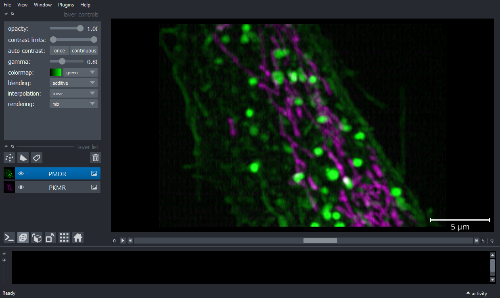
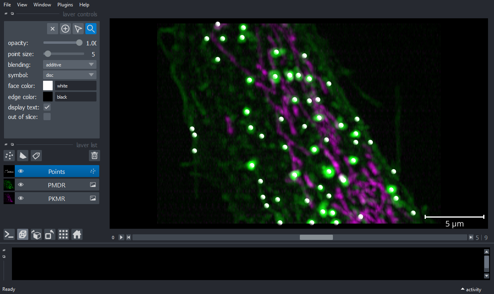
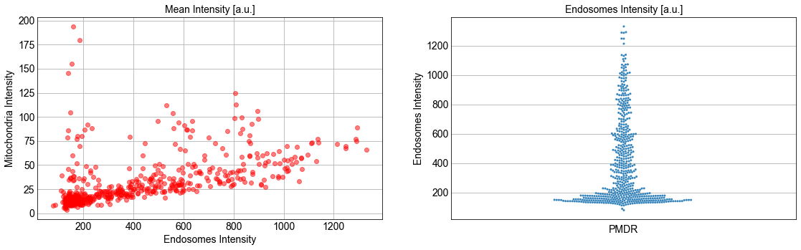

Example 1: Stracking workflow
=============================

This example shows how to detect particles in 3D+t image using the LoG
detector

Load data
---------

.. code-block:: python3

    from stracking import data
    from tifffile import imread
    
    folder=""
    
    filenamePKMR="PKMR_10timepoints_crop.tif"
    filenamePMDR="PMDR_10timepoints_crop.tif"
    PKMRimg= imread(folder+filenamePKMR)
    PMDRimg= imread(folder+filenamePMDR)

Create an empty napari viewer
-----------------------------

.. code-block:: python3

    %gui qt

    import napari
    from napari.utils import nbscreenshot
    viewer = napari.Viewer(axis_labels='tzyx')

Display volumetric timeseries
-----------------------------

.. code-block:: python3

    viewer.add_image(PKMRimg, name='PKMR', multiscale=False, scale=[4.3,0.316,0.104,0.104],
                contrast_limits=[10, 600], colormap='magenta',blending='additive');
    
    viewer.add_image(PMDRimg, name='PMDR', multiscale=False, scale=[4.3,0.316,0.104,0.104],
                contrast_limits=[10, 1_000], colormap='green',blending='additive',gamma=0.8);
    
    viewer.dims.ndisplay = 3
    viewer.scale_bar.visible='true'
    viewer.scale_bar.unit='um'
    nbscreenshot(viewer)

LoG 3D+t detection
------------------

.. code-block:: python3

    from stracking.detectors import LoGDetector
    
    detector = LoGDetector(min_sigma=3, max_sigma=5, num_sigma=3, threshold=0.001)
    particles = detector.run(PMDRimg)
    

Display spots
~~~~~~~~~~~~~

.. code-block:: python3

    viewer.add_points(particles.data, size=5, shading='spherical',scale=[4.3,0.316,0.104,0.104],blending='additive')
    nbscreenshot(viewer)

Spots properties
----------------

.. code-block:: python3

    from stracking.properties import IntensityProperty
    
    property_calc = IntensityProperty(radius=2.5)
    property_calc.run(particles,PKMRimg)
    y=particles.properties['mean_intensity']
    particlesch1=particles
    property_calc = IntensityProperty(radius=2.5)
    property_calc.run(particles,PMDRimg)
    x=particles.properties['mean_intensity']

Spots statistics
~~~~~~~~~~~~~~~~

.. code-block:: python3

    import matplotlib.pyplot as plt
    import numpy as np
    from matplotlib import colors
    from matplotlib.ticker import PercentFormatter
    import seaborn as sns
    
    plt.style.use('_mpl-gallery')
    fig, axs = plt.subplots(1, 2, figsize=(15, 4), sharey=False)
    axs[0].set_title("Mean Intensity [a.u.]",fontsize=14)
    axs[0].set_ylabel("Mitochondria Intensity",fontsize=14)
    axs[0].set_xlabel("Endosomes Intensity",fontsize=14)
    axs[0].scatter(x,y,alpha=0.5,color='r');
    axs[0].tick_params(axis='both', labelsize=14)
    sns.set_style("whitegrid")
    axs[1] = sns.swarmplot(y=x,alpha=0.9,size=3)
    axs[1].set_ylabel("Endosomes Intensity",fontsize=14)
    axs[1].set_xlabel("PMDR",fontsize=14)
    axs[1].set_title("Endosomes Intensity [a.u.]",fontsize=14)
    axs[1].tick_params(axis='both',labelsize=14)

Tracker
-------

Shortest path tracking with euclidean cost

.. code-block:: python3

    from stracking.linkers import SPLinker, EuclideanCost
    
    euclidean_cost = EuclideanCost(max_cost=225)
    my_tracker = SPLinker(cost=euclidean_cost, gap=1)
    tracks = my_tracker.run(particles)
    

.. parsed-literal::

    detections shape= (564, 4)
    num frames= 10
    cost= 1.0
    self.cost.max_cost= 225
    cost= 2819.0
    self.cost.max_cost= 225
    cost= 5433.0
    self.cost.max_cost= 225
    cost= 8438.0
    self.cost.max_cost= 225
    extract track...
    dim in track to path= 3
    add predecessor...
    add predecessor...
    

Display tracks
~~~~~~~~~~~~~~

.. code-block:: python3

    viewer.add_tracks(tracks.data, name='Tracks',scale=[4.3,0.316,0.104,0.104])
    nbscreenshot(viewer)

.. image:: images/output_Example1_4.png
   :width: 600

Features - tracking
-------------------

.. code-block:: python3

    from stracking.features import (LengthFeature, DistanceFeature,
                                    DisplacementFeature)
    
    tracks.scale=[1,0.316,0.104,0.104];
    
    # Length feature
    feature_calc = LengthFeature()
    tracks = feature_calc.run(tracks)
    
    # Distance feature
    feature_calc = DistanceFeature()
    tracks = feature_calc.run(tracks)
    
    # Displacement feature
    feature_calc = DisplacementFeature()
    tracks = feature_calc.run(tracks)
    
    

Display tracks properties
~~~~~~~~~~~~~~~~~~~~~~~~~

.. code-block:: python3

    displacement=tracks.features['displacement'];
    distance=tracks.features['distance'];
    length=tracks.features['length'];
    
    displacementMat = np.array([displacement[i] for i in range(len(displacement))])
    distanceMat = np.array([distance[i] for i in range(len(distance))])
    lengthMat = np.array([length[i] for i in range(len(length))])
    speed=distanceMat/(4.3*lengthMat)
    
    fig, axs = plt.subplots(1, 3, figsize=(15, 4), sharey=False)
    
    axs[0].hist(4.3*lengthMat, bins=8, edgecolor="white")
    axs[0].set_xlabel("Track Duration [s]",fontsize=14)
    axs[0].set_ylabel("Frequency",fontsize=14)
    axs[0].tick_params(axis='both', labelsize=14)
    
    axs[1].boxplot([speed],patch_artist=True,
                   medianprops={"color": "red", "linewidth": 1.5},
                   boxprops={"facecolor": "white", "edgecolor": "black",
                              "linewidth": 1.5},
                    whiskerprops={"color": "black", "linewidth": 1.5},
                    capprops={"color": "black", "linewidth": 1.5},labels=[''])
    axs[1].set_ylabel("Speed [um/s]",fontsize=14)
    axs[1].set_xlabel("PMDR",fontsize=14)
    axs[1].tick_params(axis='both', labelsize=14)
    
    
    axs[2].hist(displacementMat/distanceMat, bins=10, edgecolor="white",facecolor='gray',alpha=0.9)
    axs[2].set_xlabel("Persistance [a. u.]",fontsize=14)
    axs[2].set_ylabel("Frequency",fontsize=14)
    axs[2].tick_params(axis='both', labelsize=14)
    

.. image:: images/output_Example1_5.png
   :width: 600

Features tracking
-----------------

.. code-block:: python3

    from stracking.filters import FeatureFilter
        
    f_filter = FeatureFilter(feature_name='length', min_val=10, max_val=100)
    filtered_tracks = f_filter.run(tracks)
    
    viewer.add_tracks(filtered_tracks.data,features=filtered_tracks.features,name='Filtered Tracks',scale=[4.3,0.316,0.104,0.104])
    viewer.layers['Tracks'].visible=False
    nbscreenshot(viewer)
    
.. image:: images/output_Example1_6.png
   :width: 600

